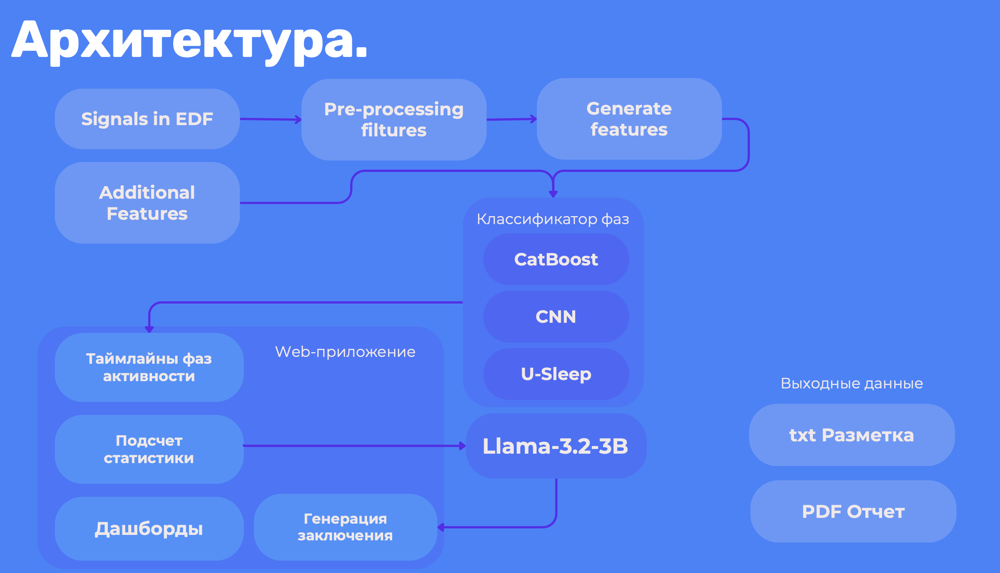

# Система классификации электрокортикограмм

Наша система представляет кроссплатформенное Web-приложение для анализа ЭКоГ обеспечивает автоматическую классификацию фаз сна и обнаружение эпилептических приступов. Используя мощные алгоритмы машинного обучения и адаптивные функции, система способна обрабатывать большой объем данных ЭЭГ, что позволяет выявлять критические изменения активности мозга с учетом воздействия препаратов.

Технические особенности: Python, Streamlit, CatBoost, PyTorch, REST API, Docker.

Комплексное решение для анализа ЭЭГ сочетает каскадную систему фильтрации сигналов, глубокие нейронные сети и адаптивные алгоритмы, позволяя автоматически распознавать состояния мозга с учетом фармакологических воздействий, что делает его незаменимым инструментом для медицинских и исследовательских центров.

# Пример решения


# Установка
- `git clone https://github.com/tarasovxx/classification-system-ekog.git`
# Запуск без поодержки моделей, только визуализация
```bash
streamlit run main.py

or

docker-compose up --build streamlit -d
```
# Запуск всей системы
```
docker-compose up --build -d
```
Чтобы всё работал необходимо установить `docker` с оффициального сайта под свою систему Windows/Linux/MacOS:
https://docs.docker.com/engine/install/

# Используемое решение

- **Pre-processing** (Предобработка данных)
IIR-FIR Filters: IIR (Infinite Impulse Response) и FIR (Finite Impulse Response) фильтры, которые удаляют нежелательные частотные компоненты в сигнале ЭЭГ.

- **Butterworth Filter**: Фильтр с плавной амплитудно-частотной характеристикой, минимизирующий искажения сигнала, часто используется для полосовой фильтрации.

- **Band-pass Filters**: Полосовые фильтры, позволяющие проходить только определенным диапазонам частот, что полезно для выделения альфа, тета, дельта ритмов ЭЭГ.

- **Discrete Wavelet Transform** (DWT): Дискретное вейвлет-преобразование, которое декомпозирует сигнал на временно-частотные компоненты, позволяя изолировать и фильтровать определенные диапазоны частот.

- **Empirical Mode Decomposition** (EMD): Эмпирическое модовое разложение, разделяющее нестационарные сигналы на составляющие для устранения артефактов и улучшения фильтрации.

- **Sifting Process**: Метод, используемый в EMD, для выделения основных режимов сигнала и удаления шумов.

- **Independent Component Analysis** (ICA): Метод для удаления артефактов, таких как глазные движения, за счет выделения независимых компонентов сигнала.

- **Principal Component Analysis** (PCA): Используется для уменьшения размерности данных и подавления шума путем выделения наиболее информативных компонентов.

- **Wavelet Packet Decomposition** (WPD): Расширение DWT, которое разбивает сигнал на большее количество частотных диапазонов, включая высокочастотные составляющие.

- **Low-pass и High-pass Filters**: Низкочастотные и высокочастотные фильтры для удаления низко- и высокочастотных шумов, соответственно.

- **Morphological Filtering**: Метод для выделения форм и паттернов в данных ЭЭГ, полезный для фильтрации кратковременных всплесков и артефактов.

- **Hilbert-Huang Transform** (HHT): Анализ нелинейных и нестационарных данных на основе EMD для выделения мгновенных частотных характеристик.

- **Time-Frequency Distributions** (TFD): Например, распределение Вигнера-Вилля, дающее представление о временно-частотной структуре сигнала.

-------------------------

- **Feature Extraction** (Извлечение признаков)
Spectral Features: Частотные признаки, такие как спектральная мощность и пиковая частота, полезные для анализа фаз сна и эпилептических событий.

- **Hjorth Parameters**: Статистические признаки, описывающие активность, подвижность и сложность сигнала, для анализа времени и частоты.

- **Fractal Dimension** (FD): Признак, характеризующий сложность сигнала, полезный для выявления аномальных паттернов, таких как эпилептические разряды.

- **Entropy Measures** (ApEn и Shannon Entropy): Энтропийные признаки, такие как аппроксимационная энтропия (ApEn) и энтропия Шеннона, измеряют уровень случайности и разнообразия в сигнале.

- **Wavelet Features**: Признаки, извлеченные из коэффициентов DWT, такие как энергия вейвлет-компонент на разных частотах, полезные для различения состояний активности мозга.
* Визуализация кластеризации происходит посредством Streamlit. 

# Стек используемых технологий:

`Python3`, `git`, `GitHub`, `PyEdfREader` - инструменты разработки

`PyTorch`, `Transformers`, `Ollama`, `CatBoost` - библиотеки глубокого обучения

`Plotly`, `Streamlit`, `AltChart` - инструменты визуализации


## Архитектура




# Разработчики
| Имя             | Роль              | Контакт                                    |
|-----------------|-------------------|--------------------------------------------|
| Оленников Вадим | Full Stack        | [t.me/ltdigor](https://t.me/LTDigor)       |
| ---             | ---               | ---                                        |
| Александр Серов | Machine Learning  | [t.me/thegoldian](https://t.me/thegoldian) |
| ---             | ---               | ---                                        |
| Артём Тарасов   | Software Engineer | [t.me/tarasovxx](https://t.me/tarasovxx)   |
| ---             | ---               | ---                                        |
| Ванданов Сергей | Machine Learning  | [t.me/rapid76](https://t.me/rapid76)       |
| ---             | ---               | ---                                        |
| Даниил Галимов  | Data Analyst      | [t.me/Dan_Gan](https://t.me/Dan_Gan)       |
| ---             | ---               | ---                                        |